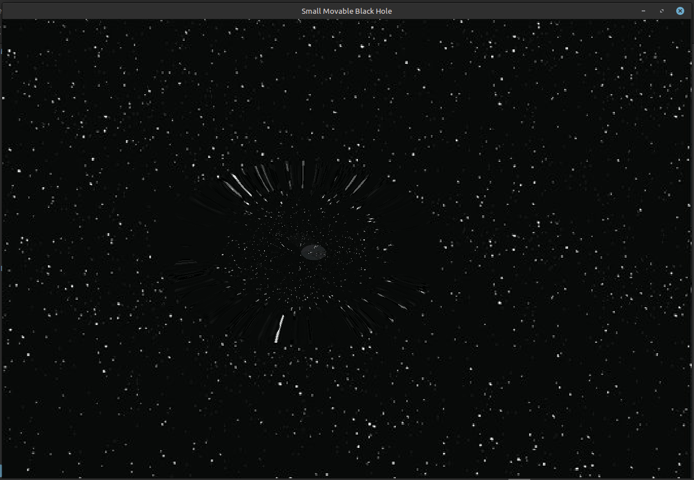
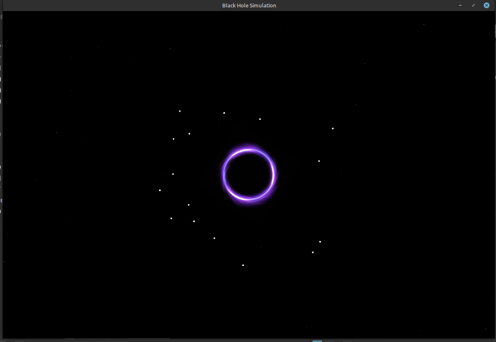
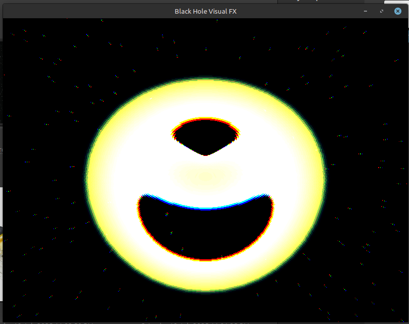
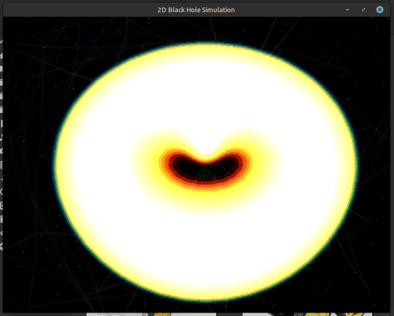
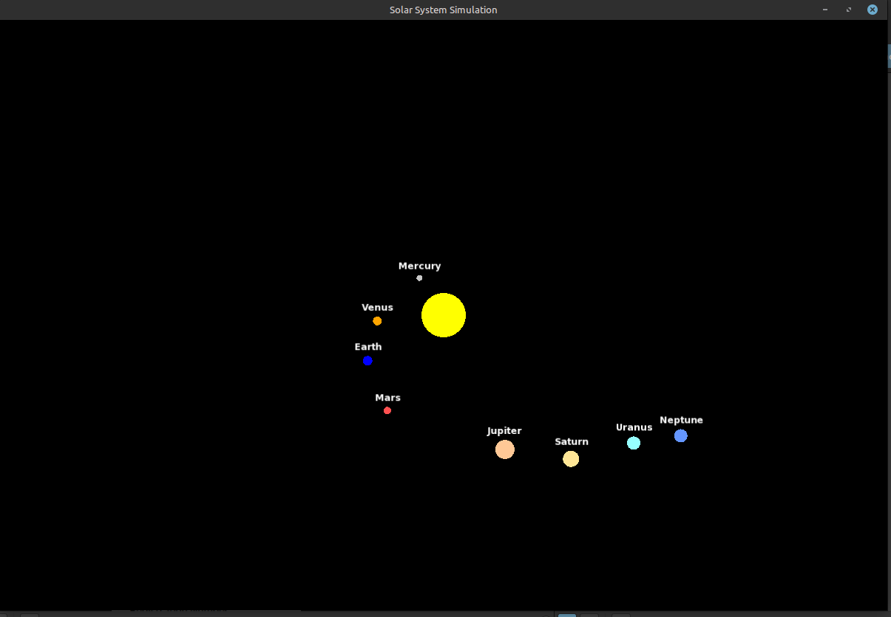
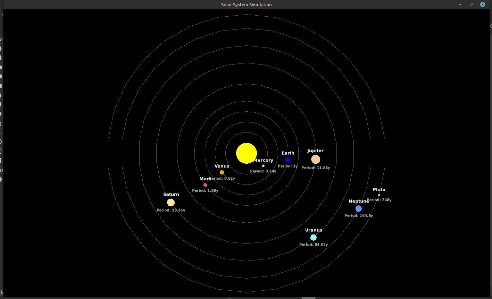
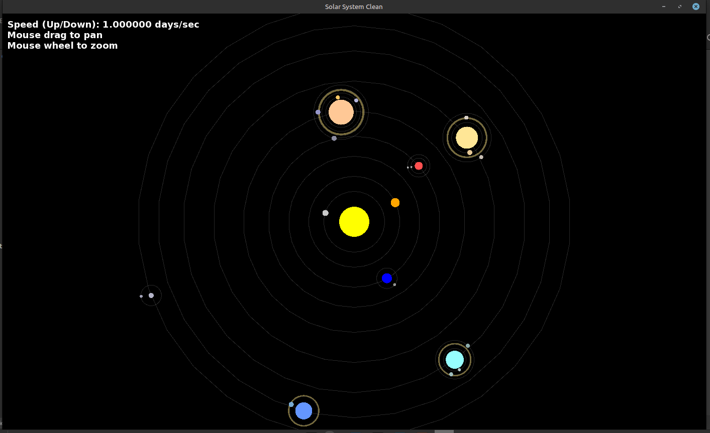
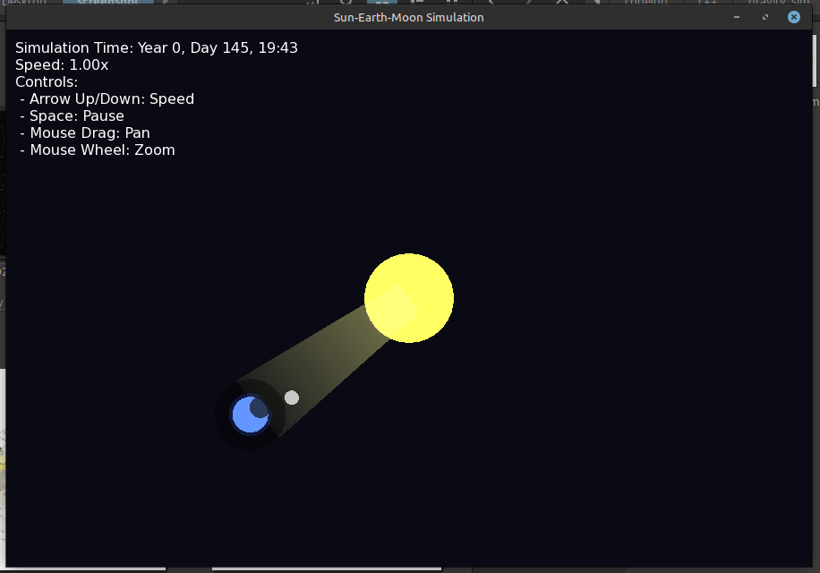

# 🌌 Gravity Simulations Collection

A set of advanced **C++ & SFML** projects visualizing **black holes**, **gravitational lensing**, and **solar system dynamics** using shaders and real-time physics. Each folder is a standalone simulation showcasing visually rich astrophysical phenomena.

---

## 📁 Project Structure

```
.vscode/                → VSCode settings
blackhole00/            → Shader + gravity simulations
blackhole01/            → Black hole with accretion ring
blackhole02/            → Shader-based black hole lensing
blackhole03/            → Accretion disk + starfield + distortion
blackhole04/            → Combined black hole + solar system
solarsystem05/          → Full solar system orbits
solorsystem06/          → Extended solar simulation
solorsystem07/          → Sun-Earth-Moon eclipse simulation
```

---
## Screenshots

|  |  |
|:--:|:--:|
| **blackhole00** | **blackhole01** |

|  |  |
|:--:|:--:|
| **blackhole02** | **blackhole03** |

|  |  |
|:--:|:--:|
| **blackhole04** | **solarsystem05** |

|  |  |
|:--:|:--:|
| **solorsystem06** | **solorsystem07** |

## ✨ Features

* 🌑 **Black Hole Visualizations**

  * Real-time lensing shaders
  * Accretion disk glow
  * Orbiting star particles
  * Gravitational distortion

* 🌍 **Solar System Simulations**

  * Planetary orbits
  * Moon phases & eclipses
  * Realistic motion with dynamic zoom and pan

* 🎞️ **Visual FX**

  * GLSL fragment shaders for warping, chromatic aberration
  * Interactive controls
  * Scaled models and light bending effects

---

## 🔧 Requirements

* [SFML 2.5+](https://www.sfml-dev.org/download.php)
* **C++17** or newer
* A C++ compiler (e.g. `g++`, `clang++`)
* CMake or Makefile (not included)

---

## 🛠️ How to Build and Run

### 1. Install SFML

Follow official instructions: [SFML Downloads](https://www.sfml-dev.org/download.php)

---

### 2. Compile Example

```bash
g++ blackhole03/blackhole_simulation.cpp -o blackhole03/blackhole_simulation -lsfml-graphics -lsfml-window -lsfml-system
cd blackhole03
./blackhole_simulation
```

Make sure to **run from the same folder** so shaders/images load correctly.

---

### 3. Controls (applies to most simulations)

| Key / Mouse   | Action                  |
| ------------- | ----------------------- |
| `Arrow Keys`  | Adjust simulation speed |
| `Space`       | Pause/resume simulation |
| `Mouse Drag`  | Pan the simulation view |
| `Mouse Wheel` | Zoom in/out             |

---

## 🔍 Simulation Details & Screenshots

> 💡 Replace the image paths with your actual screenshots placed in a folder named `screenshots/`.

---

### 🌀 `blackhole00/` – Shader + Gravity Demo

* `blackhole_shader.cpp` — basic black hole lens distortion
* `gravity_sim.cpp` — gravity field simulation


---

### 🌌 `blackhole01/` – Accretion Ring + Stars

* `blackhole_sim.cpp`
* Includes `ring.png`, `stars.jpg`, and `lens_distortion.frag`


---

### 🎯 `blackhole02/` – Shader Lensing Showcase

* `blackhole_shader.cpp` – high-intensity lensing simulation


---

### 🔄 `blackhole03/` – Accretion Disk + Starfield

* `blackhole_simulation.cpp`
* Visually rich spinning disk with distortions


---

### 🪐 `blackhole04/` – Hybrid Simulation

* `blackhole_sim.cpp` – black hole
* `solar_system.cpp` – solar system


---

### 🌠 `solarsystem05/` – Scaled Solar System

* Full planetary orbit simulation
* Procedural orbits, names, speeds

---

### 🌗 `solorsystem06/` – Extended Solar View

* Improved visuals and planet transitions
* Zoom & camera controls

---

### 🌍🌕☀ `solorsystem07/` – Sun-Earth-Moon Eclipse

* `sun_earth_moon.cpp`
* Simulates moon orbit and eclipse logic

---

## 📜 Credits

* SFML (Simple and Fast Multimedia Library)
* All shaders and visual assets created for educational and scientific visualization

---

## 🔓 License

This project is for educational purposes. You’re welcome to explore, modify, and reuse with credit.

---

## 💡 Future Ideas?

Let me know if you want to add:

* Relativistic rendering effects
* Light ray tracing
* Export to GIF or video
* UI panel to tweak black hole properties live

---

If you want help writing a script to compile & run all simulations from a terminal, just say the word.

---

## ✨ Features

* 🌑 **Black Hole Visualizations**

  * Real-time lensing shaders
  * Accretion disk glow
  * Orbiting star particles
  * Gravitational distortion

* 🌍 **Solar System Simulations**

  * Planetary orbits
  * Moon phases & eclipses
  * Realistic motion with dynamic zoom and pan

* 🎞️ **Visual FX**

  * GLSL fragment shaders for warping, chromatic aberration
  * Interactive controls
  * Scaled models and light bending effects

---

## 🔧 Requirements

* [SFML 2.5+](https://www.sfml-dev.org/download.php)
* **C++17** or newer
* A C++ compiler (e.g. `g++`, `clang++`)
* CMake or Makefile (not included)

---

## 🛠️ How to Build and Run

### 1. Install SFML

Follow official instructions: [SFML Downloads](https://www.sfml-dev.org/download.php)

---

### 2. Compile Example

```bash
g++ blackhole03/blackhole_simulation.cpp -o blackhole03/blackhole_simulation -lsfml-graphics -lsfml-window -lsfml-system
cd blackhole03
./blackhole_simulation
```

Make sure to **run from the same folder** so shaders/images load correctly.

---

### 3. Controls (applies to most simulations)

| Key / Mouse   | Action                  |
| ------------- | ----------------------- |
| `Arrow Keys`  | Adjust simulation speed |
| `Space`       | Pause/resume simulation |
| `Mouse Drag`  | Pan the simulation view |
| `Mouse Wheel` | Zoom in/out             |

---


### 🌀 `blackhole00/` – Shader + Gravity Demo

* `blackhole_shader.cpp` — basic black hole lens distortion
* `gravity_sim.cpp` — gravity field simulation


---

### 🌌 `blackhole01/` – Accretion Ring + Stars

* `blackhole_sim.cpp`
* Includes `ring.png`, `stars.jpg`, and `lens_distortion.frag`


---

### 🎯 `blackhole02/` – Shader Lensing Showcase

* `blackhole_shader.cpp` – high-intensity lensing simulation


---

### 🔄 `blackhole03/` – Accretion Disk + Starfield

* `blackhole_simulation.cpp`
* Visually rich spinning disk with distortions


---

### 🪐 `blackhole04/` – Hybrid Simulation

* `blackhole_sim.cpp` – black hole
* `solar_system.cpp` – solar system


---

### 🌠 `solarsystem05/` – Scaled Solar System

* Full planetary orbit simulation
* Procedural orbits, names, speeds


---

### 🌗 `solorsystem06/` – Extended Solar View

* Improved visuals and planet transitions
* Zoom & camera controls


---

### 🌍🌕☀ `solorsystem07/` – Sun-Earth-Moon Eclipse

* `sun_earth_moon.cpp`
* Simulates moon orbit and eclipse logic


---

## 📜 Credits

* SFML (Simple and Fast Multimedia Library)
* All shaders and visual assets created for educational and scientific visualization

---

## 🔓 License

This project is for educational purposes. You’re welcome to explore, modify, and reuse with credit.

---

## 💡 Future Ideas?

Let me know if you want to add:

* Relativistic rendering effects
* Light ray tracing
* Export to GIF or video
* UI panel to tweak black hole properties live

